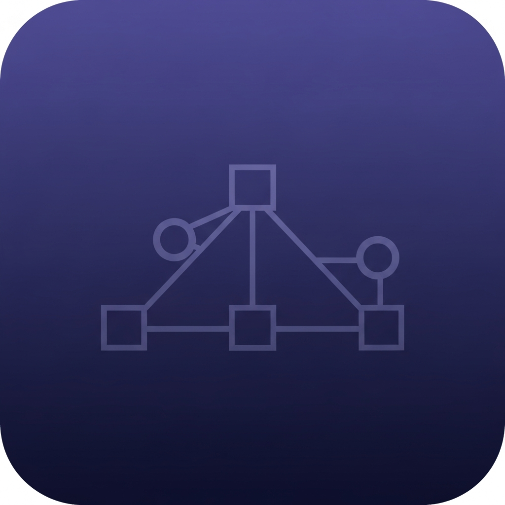

# 📱 DSA Revision Tracker

> A smart mobile app for students preparing for coding interviews and placements. Track your DSA questions, monitor confidence levels, and never miss a revision with automated spaced-repetition scheduling.

<p align="center">
  
</p>

---

## 🌐 Live App

| Platform | Link |
|----------|------|
| 📱 **Expo Go (Mobile)** | Scan QR from the [Live Preview](https://395ce506-0262-4c03-aed3-840231bf84a1-00-26usw98x1ppdv.pike.replit.dev) |
| 🌍 **Web Preview** | [Open in Browser](https://395ce506-0262-4c03-aed3-840231bf84a1-00-26usw98x1ppdv.pike.replit.dev) |

> **Best experience:** Install [Expo Go](https://expo.dev/client) on your Android/iOS phone and scan the QR code from the live preview.

---

## ✨ Features

### 📊 Smart Dashboard
- Total questions solved at a glance
- Count of **weak** (confidence ≤ 2) and **strong** (confidence ≥ 4) questions
- Questions **due for revision today** highlighted prominently
- Most frequent weak topic automatically detected

### ➕ Add Questions with Full Detail
| Field | Description |
|-------|-------------|
| Question Name | Name of the DSA problem |
| Platform | LeetCode, GFG, Codeforces, or Other |
| Topic Tags | DP, Graph, Trees, Sliding Window, and 16 more |
| Approach | Your solution strategy |
| Time Complexity | e.g. O(n log n) |
| Confidence Level | 1 (Weakest) → 5 (Strongest) |
| Last Revised Date | When you last solved it |
| Mistake Notes | What went wrong — shown with a red warning card |

### 🧠 Spaced Repetition Revision Logic
The app auto-calculates your **Next Revision Date** based on confidence:

| Confidence | Label | Next Revision |
|-----------|-------|--------------|
| 1 | Very Weak | +2 days |
| 2 | Weak | +3 days |
| 3 | Medium | +5 days |
| 4 | Strong | +7 days |
| 5 | Very Strong | +10 days |

When a question is overdue, a red **"Revise Now"** badge appears.

### 🎨 Color Coding
- 🔴 **Red** — Confidence 1–2 (Weak)
- 🟡 **Yellow** — Confidence 3 (Medium)
- 🟢 **Green** — Confidence 4–5 (Strong)

### 🔍 Search & Filter
- Search by question name
- Filter by **Platform** (LeetCode, GFG, Codeforces, Other)
- Filter by **Confidence Level** (1–5)
- Filter by **Topic Tag** (DP, Graph, Trees, etc.)
- Sort by: Due Date · Recent · Confidence · Name

### ✅ Revision Actions
- **Mark as Revised** — updates Last Revised to today and recalculates next date
- **Edit** — modify any question detail
- **Delete** — remove a question with confirmation

### 🌙 Dark / Light Mode
Manual toggle in the header — tap the moon/sun icon. Preference is saved across app restarts.

### 📝 Mistake Tracking
- Mistake notes shown in a red card on the Question Detail screen
- Helps identify repeated patterns in your errors

---

## 🖼️ Screenshots

| Dashboard | Questions List | Add Question |
|-----------|----------------|--------------|
| Stats, due items, recent activity | Search, filter, sort | Full form with confidence picker |

---

## 🚀 How to Use

### On Your Phone (Recommended)
1. Install **[Expo Go](https://expo.dev/client)** from the App Store or Google Play
2. Open the [Live Preview](https://395ce506-0262-4c03-aed3-840231bf84a1-00-26usw98x1ppdv.pike.replit.dev)
3. Scan the QR code with Expo Go (Android) or your Camera app (iOS)
4. The app loads instantly — no installation needed!

### Adding Your First Question
1. Tap the **Add Question** tab (➕ icon at the bottom)
2. Fill in the question name, platform, and select topic tags
3. Write down your approach and time complexity
4. Rate your confidence from 1–5
5. Add any mistake notes (what tripped you up)
6. Tap **Save Question** — it's stored locally on your device

### Tracking Revisions
1. Go to the **Dashboard** — questions due today appear at the top with a red badge
2. Open any question → tap **Mark as Revised Today** after you practice it
3. The next revision date auto-updates based on your confidence level
4. Check the **Questions** tab to filter weak questions and focus your study

### Using Dark Mode
- Tap the **🌙 / ☀️ icon** in the top-right corner of any tab to toggle dark/light mode

---

## 🛠️ Tech Stack

| Layer | Technology |
|-------|-----------|
| Framework | [Expo](https://expo.dev) (React Native) |
| Navigation | [Expo Router](https://expo.github.io/router) (file-based) |
| Storage | AsyncStorage (local, no backend needed) |
| UI | React Native + custom components |
| Icons | `@expo/vector-icons` (Feather) |
| Fonts | Inter (via `@expo-google-fonts`) |
| Monorepo | pnpm workspaces |
| Language | TypeScript |

---

## 🏗️ Project Structure

```
artifacts/mobile/
├── app/
│   ├── (tabs)/
│   │   ├── index.tsx        # Dashboard screen
│   │   ├── questions.tsx    # All questions with search/filter
│   │   └── add.tsx          # Add question form
│   └── question/
│       ├── [id].tsx         # Question detail view
│       └── edit/[id].tsx    # Edit question form
├── components/
│   ├── QuestionCard.tsx     # Card shown in lists
│   ├── QuestionForm.tsx     # Add/Edit form
│   └── StatCard.tsx         # Dashboard stat cards
├── context/
│   ├── QuestionsContext.tsx # Global state + AsyncStorage
│   └── ThemeContext.tsx     # Dark/light mode toggle
├── constants/
│   └── colors.ts            # Full light & dark color palette
└── hooks/
    └── useColors.ts         # Theme-aware color hook
```

---

## 💻 Run Locally

```bash
# Clone the repo
git clone https://github.com/rishu072/DSA-Revison-Tracker.git
cd DSA-Revison-Tracker

# Install dependencies
pnpm install

# Start the Expo dev server
pnpm --filter @workspace/mobile run dev
```

Then scan the QR code with **Expo Go** on your phone.

---

## 📦 Data Storage

All data is stored **locally on your device** using `AsyncStorage`. No account, no server, no internet required after first load. Your questions stay private on your phone.

---

## 🤝 Contributing

1. Fork the repository
2. Create a feature branch: `git checkout -b feature/my-feature`
3. Commit your changes: `git commit -m "Add my feature"`
4. Push to the branch: `git push origin feature/my-feature`
5. Open a Pull Request

---

## 📄 License

MIT License — free to use, modify, and distribute.

---

<p align="center">Built with ❤️ for DSA learners preparing for coding interviews</p>
